# 概要

- さくらのセキュアモバイルコネクト(以下「セキュモバ」)において、特定のモバイルゲートウェイから利用可能なIPアドレスを標準出力するコマンドです

# 利用例

- コマンドライン引数は後述します

```
$ ./get_unused_ip --token 00000000-0000-0000-0000-000000000000 --secret 1234567890 --zone="is1b" --mgw-resource-id 000000000 --cidr "192.168.1.0/28"
```

# コマンドライン引数

| 引数             | 説明                     | 備考                                                                                                              | 
|-----------------|------------------------|-----------------------------------------------------------------------------------------------------------------| 
| token           | さくらのクラウドAPIキーのアクセストークン | 取得・参照方法を後述します                                                                                                   |
| secret          | さくらのクラウドAPIシークレット      | 取得・参照方法を後述します                                                                                                   | 
| zone            | さくらのクラウドのゾーン           | 入力可能なゾーンは、 `tk1a`, `tk1b`, `is1a`, `is1b`  のいずれかです。[こちら](https://developer.sakura.ad.jp/cloud/api/1.1/) を御覧ください |
| mgw-resource-id | モバイルゲートウェイのリソースID      | 参照方法を後述します                                                                                                      |
| cidr            | 探索したいCIDR              | SIMに割当可能なIPアドレスについては、[こちら](https://manual.sakura.ad.jp/cloud/mobile-connect/support.html#simip)を御覧ください          | 

# 動作環境

- 対応OS: Windows, Linux, macOS（IntelまたはArmプロセッサ搭載）
- コマンドラインインターフェース（Powershell、ターミナル等）が利用可能であること

# 前提条件

- さくらのセキュアモバイルコネクトのユーザであること
- さくらのクラウドの任意のゾーンに、モバイルゲートウェイを作成していること
- 作成したモバイルゲートウェイにSIMを登録していること

# インストール

Github の[リポジトリURL](https://github.com/sakura-internet/mobile-connect-commands/releases)を開き、対応するプラットフォームのバイナリをダウンロードします

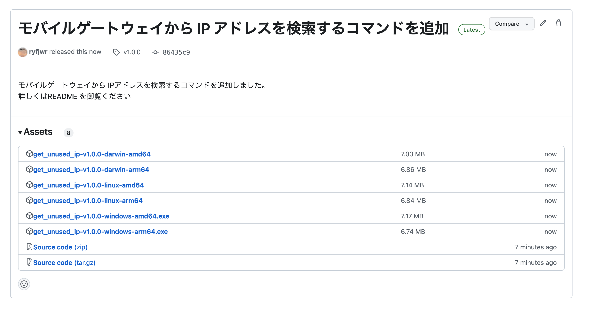

# 実行手順

## 1. さくらのクラウドへログイン

[さくらのクラウド](https://secure.sakura.ad.jp/cloud/) へログインします

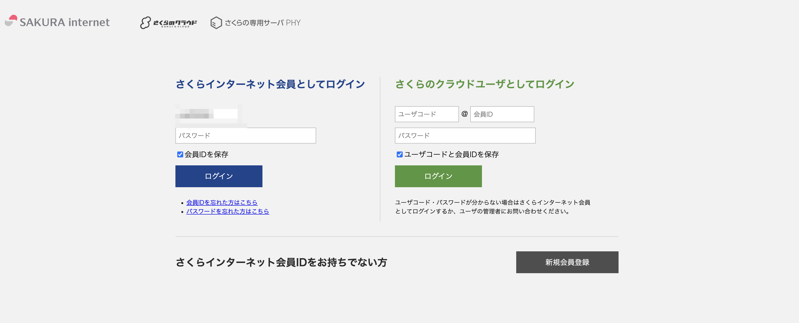

## 2. 対象のアカウントへログイン

調査したいモバイルゲートウェイが存在するアカウントを選択してください

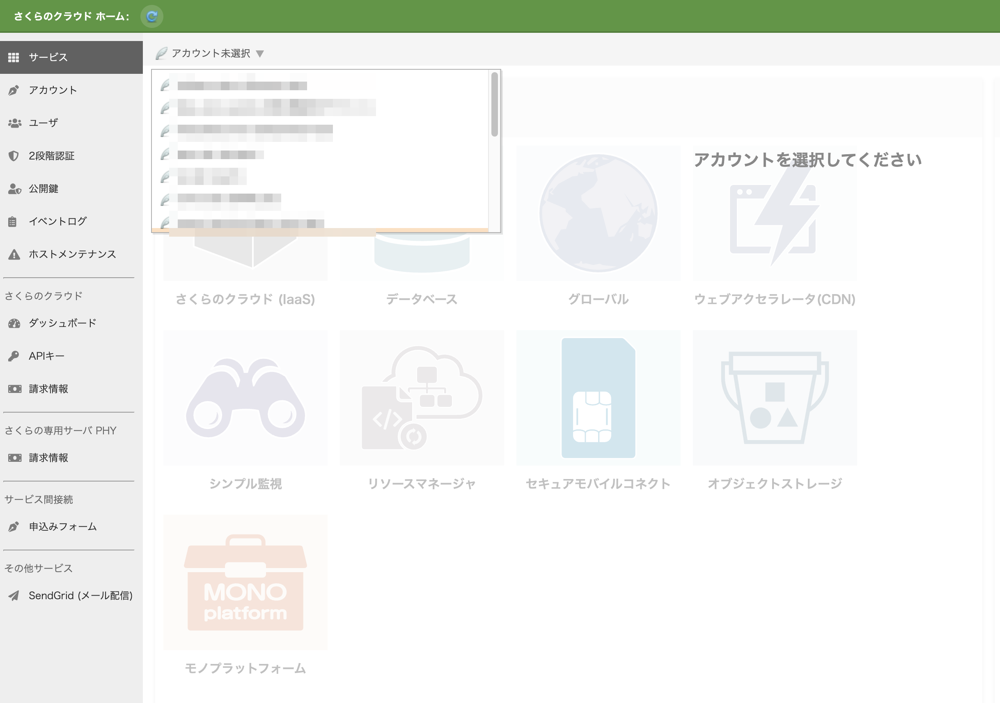

アカウントを選択したら、「セキュアモバイルコネクト」のアイコンをクリックしてください

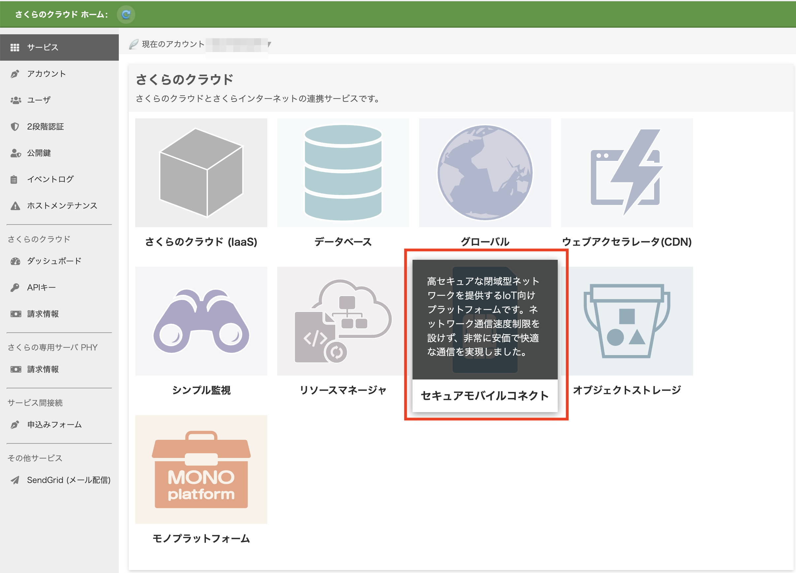

## 3. 対象のモバイルゲートウェイの確認

さくらのクラウドコントロールパネルを開きます
メニューから「モバイルゲートウェイ」を選択します

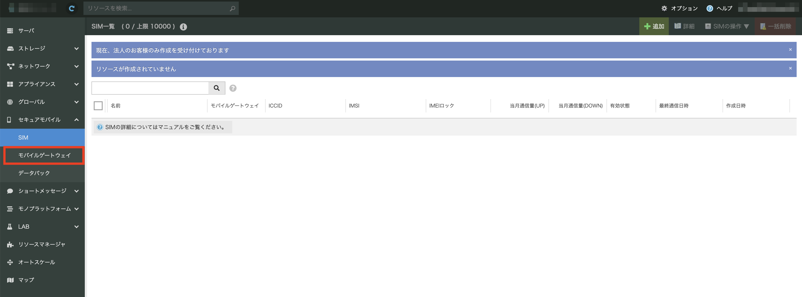

モバイルゲートウェイ一覧画面から対象のモバイルゲートウェイをダブルクリックします。

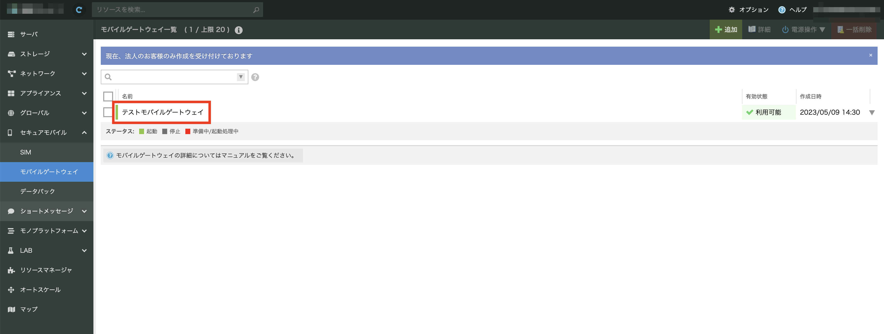

モバイルゲートウェイ詳細画面が開かれるので、リソースIDの項目を控えます

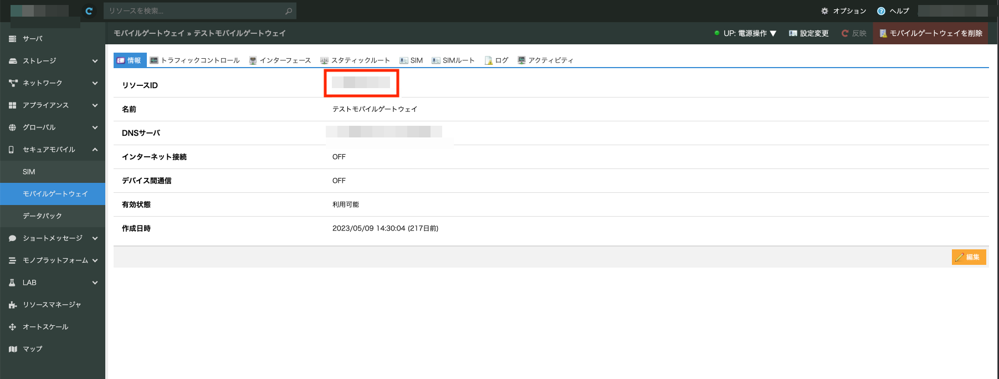


## 4. ゾーンの確認

さくらのクラウドコントロールパネルを開きます。
左上にゾーンが表示されますので、控えます。

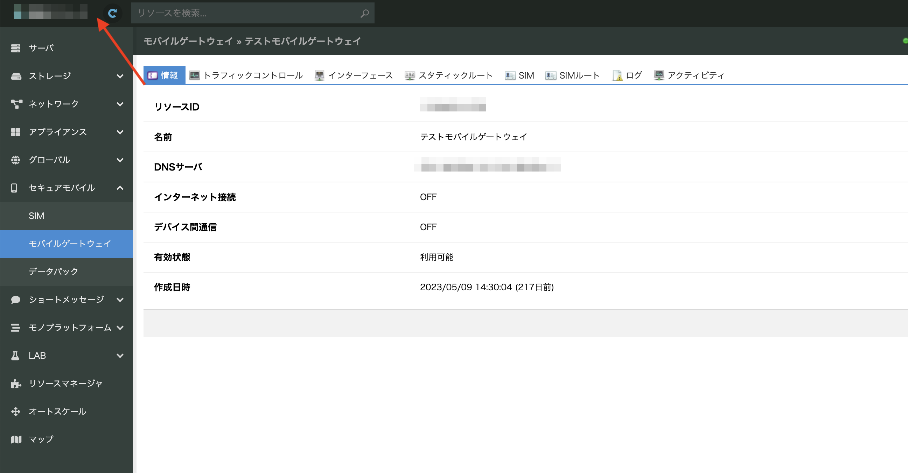

下記ゾーン表に対応するゾーンコードを控えます。

| ゾーン名    | ゾーンコード |
|---------|--------|
| 東京第1ゾーン | tk1a   |
| 東京第2ゾーン | tk1b   |
| 石狩第1ゾーン | is1a   |
| 石狩第2ゾーン | is1b   |

## 5. APIキーの発行と確認

さくらのクラウドのホームに戻ります

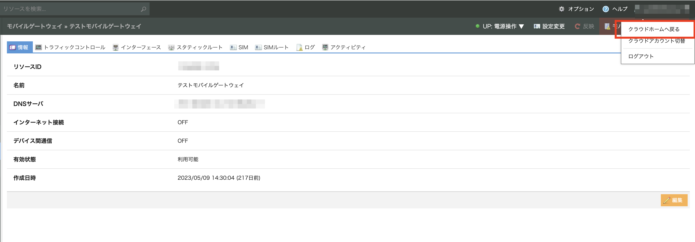

サイドメニューから「APIキー」を選択します

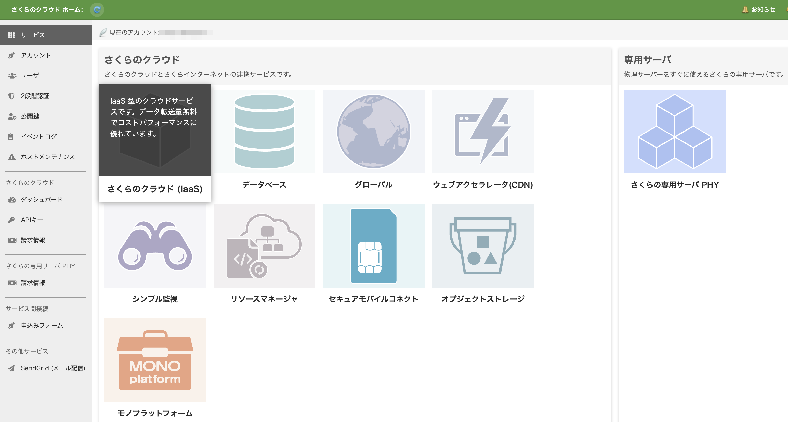

APIキーのアカウントを選択します

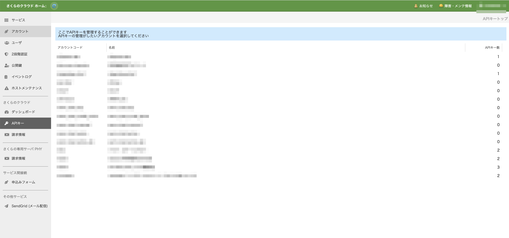

「追加」をクリックします

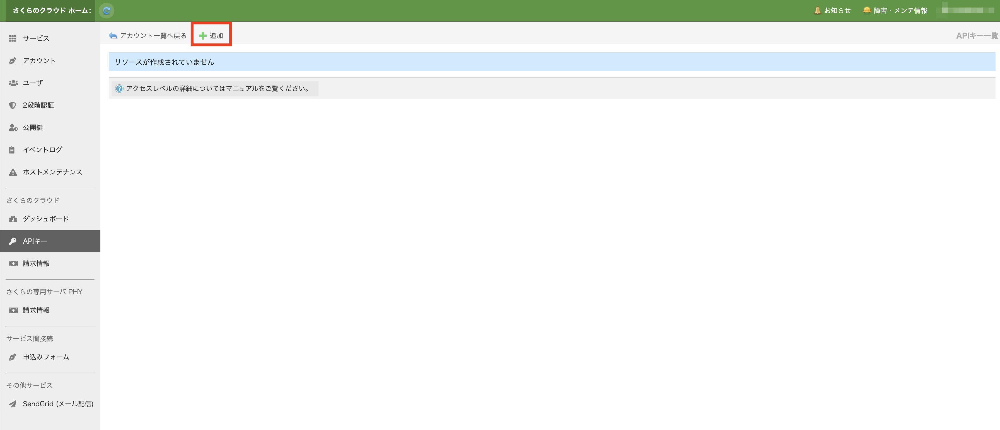

APIの作成項目のうち
「名前」に任意の文字列を、「アクセスレベル」に「リソース閲覧」をチェックし、
「作成」をクリックします。

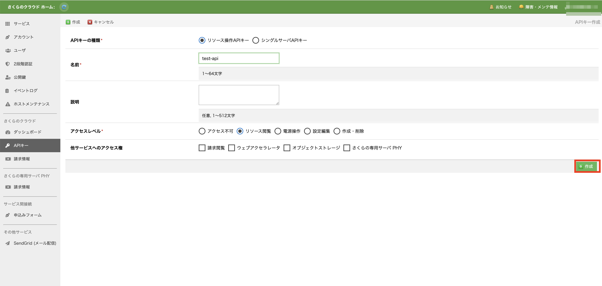

確認画面で「作成」を選択します

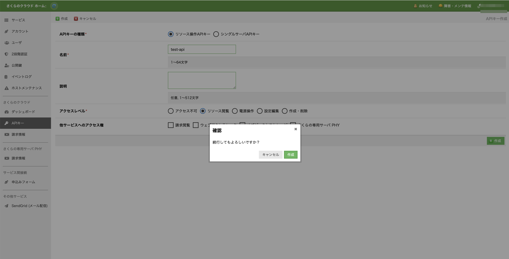

作成したAPIキーを選択し、コピーをクリックします
コピーしたトークンとシークレットをそれぞれ控えます

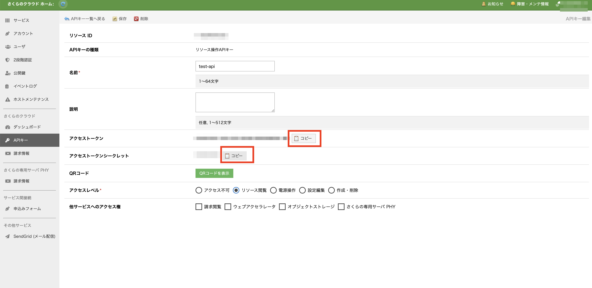

## 6. 探索したい IP アドレスの確認

探索したいCIDRを控えます
ご利用の環境に合わせて選択してください

## 7. コマンドを実行

ターミナルを開き、ダウンロードしたバイナリのディレクトリに移動します
下記のようにコマンドを実行します

```
$ ./get_unused_ip --mgw-resource-id [手順3のリソースID] --zone [手順4のゾーン] --token [手順5のトークン] --secret [手順5のトークン] --cidr [手順6のCIDR]
```

# 開発者向け情報

## テスト実行

- [Go言語](https://go.dev/)をインストールすることで自動テストを実行できます
- サポートされているGo言語のバージョンは、リポジトリの[go.mod](../go.mod)をご覧ください

```
$ git clone github.com/sakura-internet/secure-mobile-example
$ cd secure-mobile-example/get_unused_ip
$ go test
```

## コマンドのビルド

- make コマンドを利用することで、各プラットフォーム向けバイナリのビルドが可能です
- デフォルトではWindows(Arm,Intel),macOS(Arm,Intel),Linux(Arm,Intel)の6種類のバイナリがビルドできます

```
$ make
$ ls bin
get_unused_ip-latest-darwin-amd64
get_unused_ip-latest-darwin-arm64
get_unused_ip-latest-linux-amd64
get_unused_ip-latest-linux-arm64
get_unused_ip-latest-windows-amd64.exe 
get_unused_ip-latest-windows-arm64.exe
```