# 概要

- さくらのセキュアモバイルコネクト(以下「セキュモバ」)において、CSVに記載されているSIMを登録し指定したモバイルゲートウェイに割り当てるコマンドです

# 利用例

- コマンドライン引数は後述します

```
$ ./register_sim --csv simlist.csv --token 00000000-0000-0000-0000-000000000000 --secret 1234567890 --zone="is1b" --mgw-resource-id 000000000 --cidr "192.168.1.0/28"
```

# コマンドライン引数

| 引数             | 説明                     | 備考                                                                                                              | 
|-----------------|------------------------|-----------------------------------------------------------------------------------------------------------------| 
| csv             | `CSVファイル` のパス | フォーマットについては後述します |
| token           | さくらのクラウドAPIキーのアクセストークン | 取得・参照方法を後述します                                                                                                   |
| secret          | さくらのクラウドAPIシークレット      | 取得・参照方法を後述します                                                                                                   | 
| zone            | さくらのクラウドのゾーン           | 入力可能なゾーンは、 `tk1a`, `tk1b`, `is1a`, `is1b`  のいずれかです。[こちら](https://developer.sakura.ad.jp/cloud/api/1.1/) を御覧ください |
| mgw-resource-id | モバイルゲートウェイのリソースID      | 参照方法を後述します                                                                                                      |
| cidr            | 探索したいCIDR              | SIMに割当可能なIPアドレスについては、[こちら](https://manual.sakura.ad.jp/cloud/mobile-connect/support.html#simip)を御覧ください          |

## CSVファイルのフォーマット

本コマンドで参照する `CSVファイル` のフォーマットを以下に示します

- ヘッダは無しのCSV形式
- フィールドはiccid, sim パスコードの順

例:  

```
8981040000000123400,**********
8981040000000123401,**********
8981040000000123402,**********
8981040000000123403,**********
8981040000000123404,**********
8981040000000123405,**********
8981040000000123406,**********
8981040000000123407,**********
8981040000000123408,**********
8981040000000123409,**********

```

※ `********` はパスコード

# 動作環境

- 対応OS: Windows, Linux, macOS（IntelまたはArmプロセッサ搭載）
- コマンドラインインターフェース（Powershell、ターミナル等）が利用可能であること

# 前提条件

- さくらのセキュアモバイルコネクトのユーザであること
- さくらのクラウドの任意のゾーンに、モバイルゲートウェイを作成していること

# インストール

Github の[リポジトリURL](https://github.com/sakura-internet/mobile-connect-commands/releases)を開き、対応するプラットフォームのバイナリをダウンロードします

# 実行手順

## 1. さくらのクラウドへログイン

[さくらのクラウド](https://secure.sakura.ad.jp/cloud/) へログインします

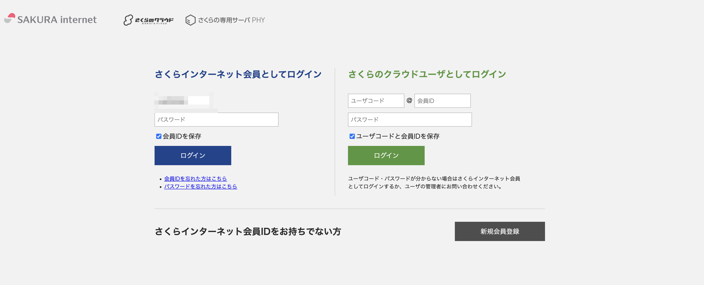

## 2. 対象のアカウントへログイン

調査したいモバイルゲートウェイが存在するアカウントを選択してください

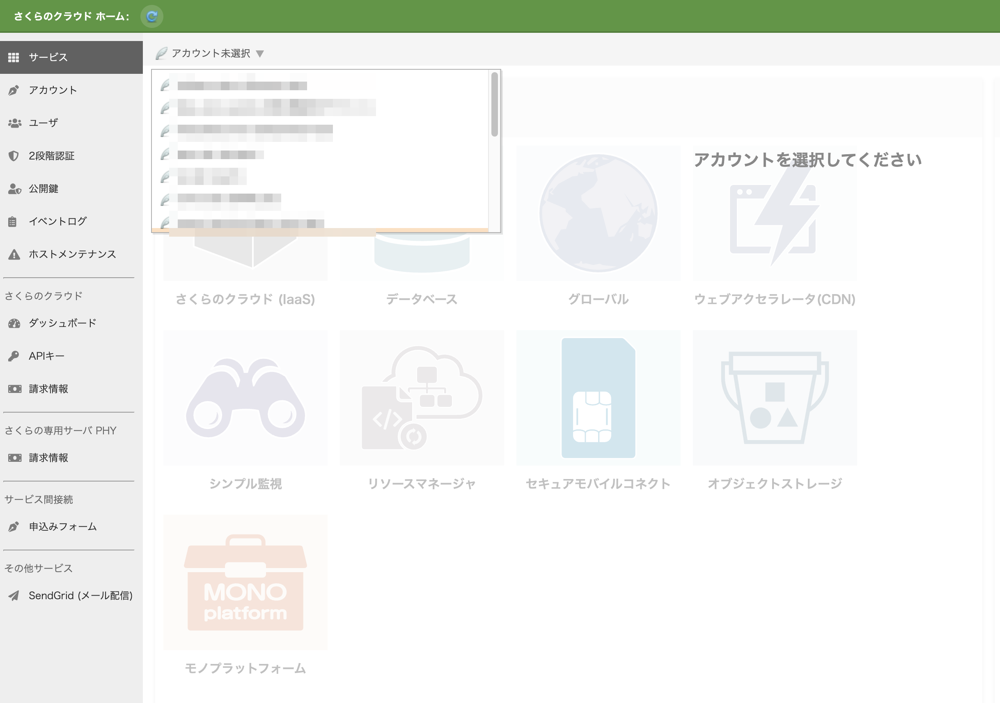

アカウントを選択したら、「セキュアモバイルコネクト」のアイコンをクリックしてください

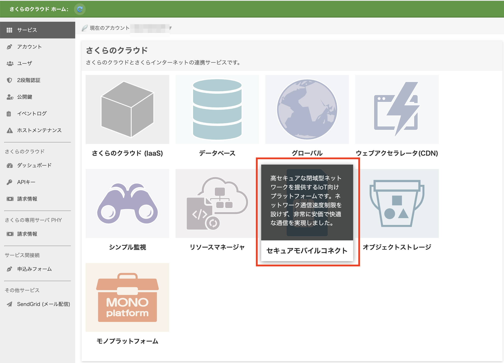

## 3. 対象のモバイルゲートウェイの確認

さくらのクラウドコントロールパネルを開きます
メニューから「モバイルゲートウェイ」を選択します

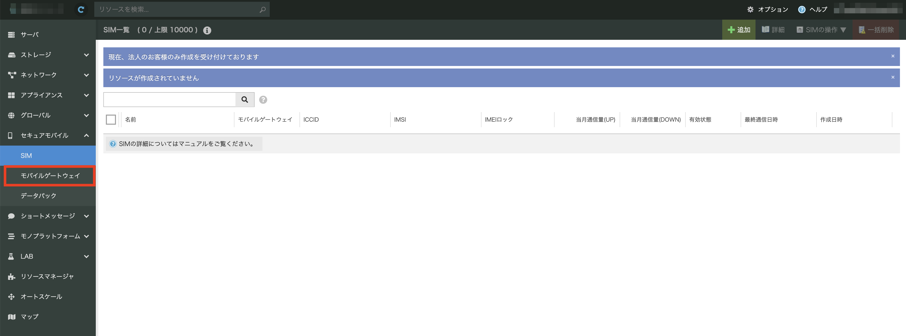

モバイルゲートウェイ一覧画面から対象のモバイルゲートウェイをダブルクリックします。

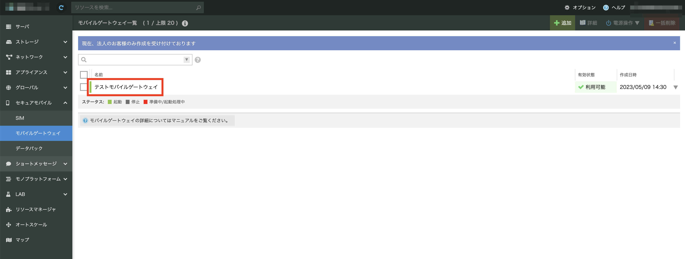

モバイルゲートウェイ詳細画面が開かれるので、リソースIDの項目を控えます

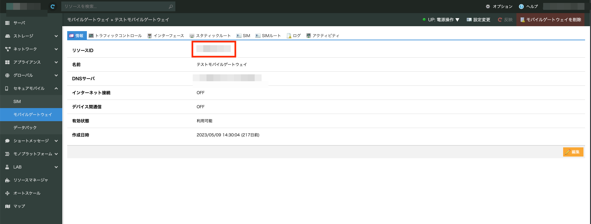


## 4. ゾーンの確認

さくらのクラウドコントロールパネルを開きます。
左上にゾーンが表示されますので、控えます。

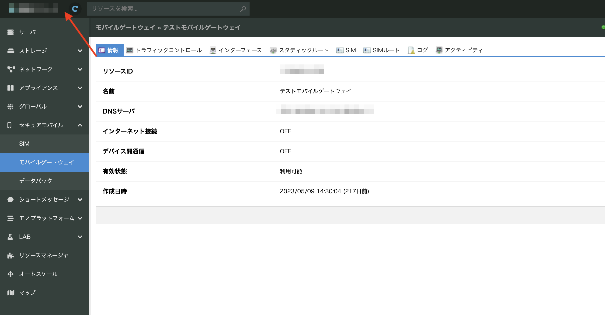

下記ゾーン表に対応するゾーンコードを控えます。

| ゾーン名    | ゾーンコード |
|---------|--------|
| 東京第1ゾーン | tk1a   |
| 東京第2ゾーン | tk1b   |
| 石狩第1ゾーン | is1a   |
| 石狩第2ゾーン | is1b   |

## 5. APIキーの発行と確認

さくらのクラウドのホームに戻ります

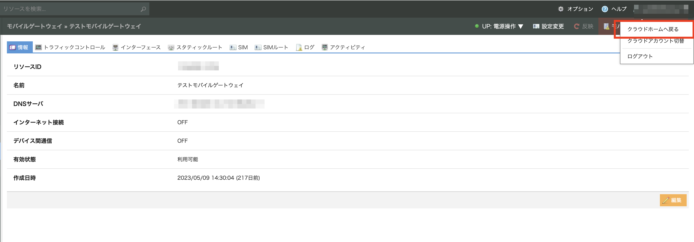

サイドメニューから「APIキー」を選択します


APIキーのアカウントを選択します

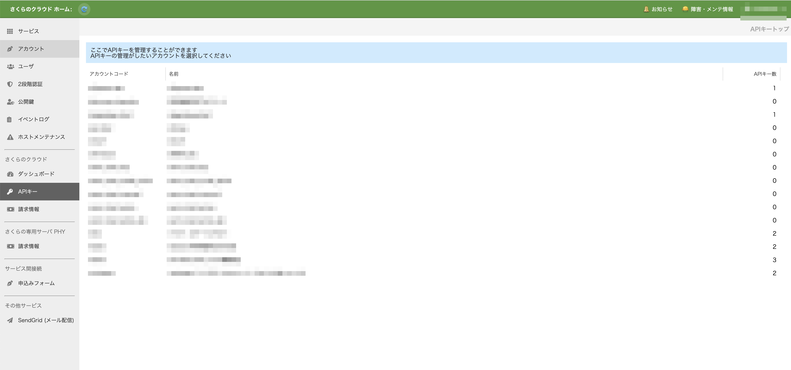

「追加」をクリックします

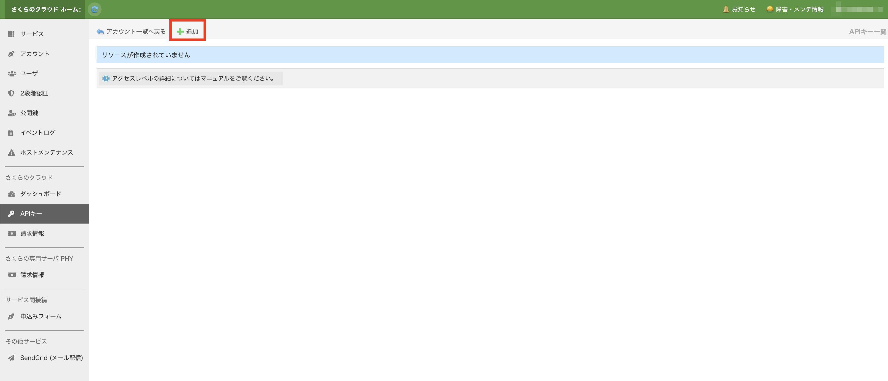

APIの作成項目のうち
「名前」に任意の文字列を、「アクセスレベル」に「リソース閲覧」をチェックし、
「作成」をクリックします。


確認画面で「作成」を選択します

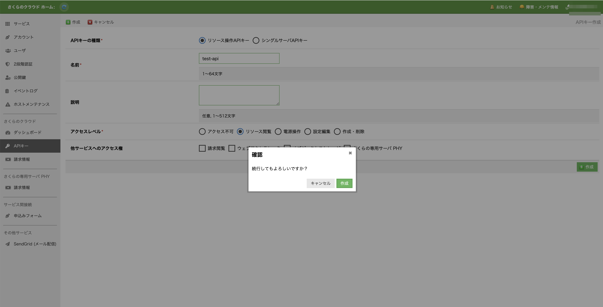

作成したAPIキーを選択し、コピーをクリックします
コピーしたトークンとシークレットをそれぞれ控えます

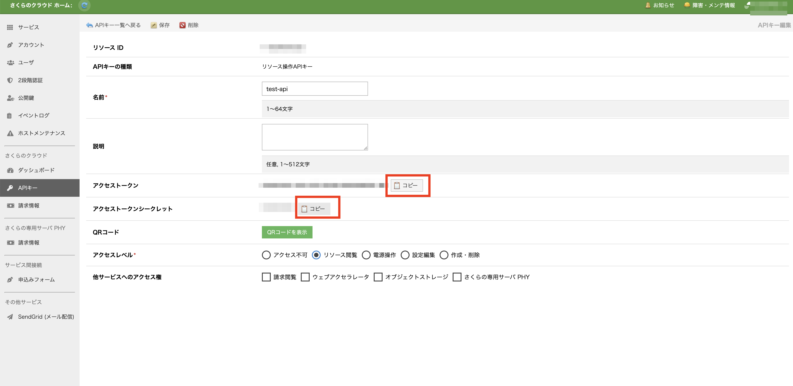

## 6. コマンドを実行

ターミナルを開き、ダウンロードしたバイナリのディレクトリに移動します
下記のようにコマンドを実行します

```
$ ./register_sim --csv [CSVファイルのパス] --mgw-resource-id [手順3のリソースID] --zone [手順4のゾーン] --token [手順5のトークン] --secret [手順5のトークン] --cidr [手順6のCIDR]
```

実行時間の目安として1枚のSIMの登録に約3秒ほどかかります  

※ 開発時の実測では300枚のSIMの登録に約11分30秒ほどかかっています  
　 1枚あたりの待ち時間はサービスの混雑状況やネットワークの状況、将来のバージョンアップ等でかかる時間が変わる可能性があります

## 7. 実行結果

### 登録に成功

1枚のSIMごとに `SIMの登録`、`モバイルゲートウェイに追加`、`IPアドレスを設定` の3つのAPIを呼び出し登録を行います  
3つのAPIがすべて成功し登録が成功した場合には以下のように表示されます

```
$ ./register_sim --csv path/to/simlist.csv --mgw-resource-id [MGWのリソースID] --zone is1b --token [アクセストークン] --secret [アクセストークンシークレット] --cidr 172.31.0.0/24
CSVファイル(path/to/simlist.csv)の読み込み中...[OK]
使用可能なIPアドレスの取得中...[OK]
SIM一括登録 開始
SIM登録(ICCID: 8981040000000751300)[OK], モバイルゲートウェイに追加[OK], IPアドレスを設定(172.31.0.1)[OK]
SIM登録(ICCID: 8981040000000751318)[OK], モバイルゲートウェイに追加[OK], IPアドレスを設定(172.31.0.2)[OK]
SIM登録(ICCID: 8981040000000751326)[OK], モバイルゲートウェイに追加[OK], IPアドレスを設定(172.31.0.3)[OK]
SIM登録(ICCID: 8981040000000751334)[OK], モバイルゲートウェイに追加[OK], IPアドレスを設定(172.31.0.4)[OK]
SIM登録(ICCID: 8981040000000751342)[OK], モバイルゲートウェイに追加[OK], IPアドレスを設定(172.31.0.5)[OK]
SIM登録(ICCID: 8981040000000751359)[OK], モバイルゲートウェイに追加[OK], IPアドレスを設定(172.31.0.6)[OK]
SIM登録(ICCID: 8981040000000751367)[OK], モバイルゲートウェイに追加[OK], IPアドレスを設定(172.31.0.7)[OK]
SIM登録(ICCID: 8981040000000751375)[OK], モバイルゲートウェイに追加[OK], IPアドレスを設定(172.31.0.8)[OK]
SIM登録(ICCID: 8981040000000751383)[OK], モバイルゲートウェイに追加[OK], IPアドレスを設定(172.31.0.9)[OK]
SIM登録(ICCID: 8981040000000751391)[OK], モバイルゲートウェイに追加[OK], IPアドレスを設定(172.31.0.10)[OK]
SIM一括登録 完了

```

### SIMが登録済み

既に登録済みのSIMと同じICCIDのSIMを登録しようとした場合は `SIM登録` の実行結果に `[SKIP]` と表示し次のSIMの登録に移ります

```
$ ./register_sim --csv path/to/simlist.csv --mgw-resource-id [MGWのリソースID] --zone is1b --token [アクセストークン] --secret [アクセストークンシークレット] --cidr 172.31.0.0/24
CSVファイル(path/to/simlist.csv)の読み込み中...[OK]
使用可能なIPアドレスの取得中...[OK]
SIM一括登録 開始
SIM登録(ICCID: 8981040000000751300)[SKIP]
SIM登録(ICCID: 8981040000000751318)[SKIP]
SIM登録(ICCID: 8981040000000751326)[SKIP]
SIM登録(ICCID: 8981040000000751334)[SKIP]
SIM登録(ICCID: 8981040000000751342)[SKIP]
SIM登録(ICCID: 8981040000000751359)[SKIP]
SIM登録(ICCID: 8981040000000751367)[SKIP]
SIM登録(ICCID: 8981040000000751375)[SKIP]
SIM登録(ICCID: 8981040000000751383)[SKIP]
SIM登録(ICCID: 8981040000000751391)[SKIP]
SIM一括登録 完了

```

**注意**  
SIMが登録済みかどうかで判定を行っているため、`SIM登録` が成功し `モバイルゲートウェイに追加` や `IPアドレスを設定` が成功していない状態で再度コマンドを実行した場合でも `[SKIP]` と判定します  
再度コマンドを実行する場合は、事前に登録されたSIMをコントロールパネルから削除してください


### SIMの登録に失敗

ICCIDまたはパスコードに誤りがあって登録に失敗した場合 `SIM登録(ICCID:[登録するSIMのICCID])` のあとに `[FAILED]` と表示し、APIのエラーメッセージを表示します  
該当するSIMで処理が中断しコマンドは終了します

#### 例: パスコードに誤りがある場合

```
$ ./register_sim --csv path/to/simlist.csv --mgw-resource-id [MGWのリソースID] --zone is1b --token [アクセストークン] --secret [アクセストークンシークレット] --cidr 172.31.0.0/24
CSVファイル(path/to/simlist.csv)の読み込み中...[OK]
使用可能なIPアドレスの取得中...[OK]
SIM一括登録 開始
SIM登録(ICCID: 8981040000000751300)[SKIP]
SIM登録(ICCID: 8981040000000751318)[FAILED]
21a76d476463a6ee00bccd147ba80eb1: (400 Bad Request)不適切な要求です。パラメータの指定誤り、入力規則違反です。入力内容をご確認ください。
パスコードが正しくありません。

```

### モバイルゲートウェイへの追加に失敗

SIMのモバイルゲートウェイへ登録に失敗した場合 `モバイルゲートウェイに追加` のあとに `[FAILED]` と表示し、APIのエラーメッセージを表示します  
該当するSIMで処理が中断しコマンドは終了します

```
$ ./register_sim --csv path/to/simlist.csv --mgw-resource-id [MGWのリソースID] --zone is1b --token [アクセストークン] --secret [アクセストークンシークレット] --cidr 172.31.0.0/24
CSVファイル(path/to/simlist.csv)の読み込み中...[OK]
使用可能なIPアドレスの取得中...[OK]
SIM一括登録 開始
SIM登録(ICCID: 8981040000000751300)[OK], モバイルゲートウェイに追加[FAILED]
<APIのエラーメッセージ>

```

### IPアドレスの割り当てに失敗

IPアドレスの割り当てに失敗した場合 `IPアドレスを設定([設定するIPアドレス])` のあとに `[FAILED]` と表示し、続いてAPIのエラーメッセージを表示します  
該当するSIMで処理が中断しコマンドは終了します

```
$ ./register_sim --csv path/to/simlist.csv --mgw-resource-id [MGWのリソースID] --zone is1b --token [アクセストークン] --secret [アクセストークンシークレット] --cidr 172.31.0.0/24
CSVファイル(path/to/simlist.csv)の読み込み中...[OK]
使用可能なIPアドレスの取得中...[OK]
SIM一括登録 開始
SIM登録(ICCID: 8981040000000751300)[OK], モバイルゲートウェイに追加[OK], IPアドレスを設定(172.31.0.1)[FAILED]
<APIのエラーメッセージ>

```

### CSVファイルが読み込めない

CSVファイルが読み込めない場合、`CSVファイル([CSVファイルのパス])の読み込み中...[NG]` と表示し、続いてエラーメッセージを表示し処理を中断、コマンドが終了します

#### 例: ファイルが存在しない場合

```
$ ./register_sim --csv invalid/path/to/simlist.csv --mgw-resource-id [MGWのリソースID] --zone is1b --token [アクセストークン] --secret [アクセストークンシークレット] --cidr 172.31.0.0/24
CSVファイル(invalid/path/to/simlist.csv)の読み込み中...[NG]
CSVファイルのオープンに失敗しました...open invalid/path/to/simlist.csv: The system cannot find the file specified.

```

### モバイルゲートウェイで未使用のIPアドレスの検索に失敗

アクセストークン、アクセストークンシークレットに誤りがある、存在しないモバイルゲートウェイのリソースIDを指定するなど未使用のIPアドレスの検索に失敗居た場合、`使用可能なIPアドレスの取得中...[NG]` と表示し処理が中断、コマンドが終了します

#### 例: アクセストークン、アクセストークンシークレットに誤りがある場合

```
$ ./register_sim --csv path/to/simlist.csv --mgw-resource-id [MGWのリソースID] --zone is1b --token [アクセストークン] --secret [アクセストークンシークレット] --cidr 172.31.0.0/24
CSVファイル(path/to/simlist.csv)の読み込み中...[OK]
使用可能なIPアドレスの取得中...[NG]
アクセストークン、アクセストークンシークレットを確認してください。SIM情報の取得に失敗しました

```

#### 例: モバイルゲートウェイのリソースIDに誤りがある場合

```
$ ./register_sim --csv path/to/simlist.csv --mgw-resource-id [MGWのリソースID] --zone is1b --token [アクセストークン] --secret [アクセストークンシークレット] --cidr 172.31.0.0/24
CSVファイル(path/to/simlist.csv)の読み込み中...[OK]
使用可能なIPアドレスの取得中...[NG]
モバイルゲートウェイのリソースIDを確認してください。SIM情報の取得に失敗しました

```


# 開発者向け情報

## テスト実行

- [Go言語](https://go.dev/)をインストールすることで自動テストを実行できます
- サポートされているGo言語のバージョンは、リポジトリの[go.mod](../go.mod)をご覧ください

```
$ git clone github.com/sakura-internet/secure-mobile-example
$ cd secure-mobile-example/register_sim
```

### テストデータの用意

testdataディレクトリを作成します

```
$ mkdir testdata
```

テストコマンドの設定ファイル `config.csv` を用意します

```
[トークン],[シークレット],[ゾーン],[モバイルゲートウェイのリソースID]
```

SIM登録テストに使用する `simlist.csv` を用意します


### テストコマンドの実行

```
$ go test
```

## コマンドのビルド

- make コマンドを利用することで、各プラットフォーム向けバイナリのビルドが可能です
- デフォルトではWindows(Arm,Intel),macOS(Arm,Intel),Linux(Arm,Intel)の6種類のバイナリがビルドできます

```
$ make
$ ls bin
register_sim-latest-darwin-amd64
register_sim-latest-darwin-arm64
register_sim-latest-linux-amd64
register_sim-latest-linux-arm64
register_sim-latest-windows-amd64.exe 
register_sim-latest-windows-arm64.exe
```
